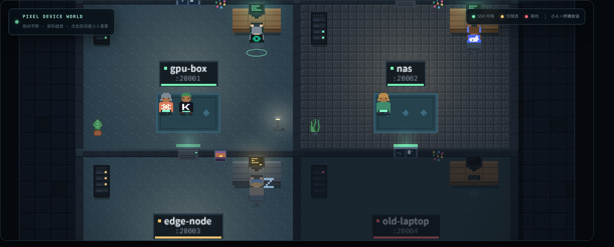
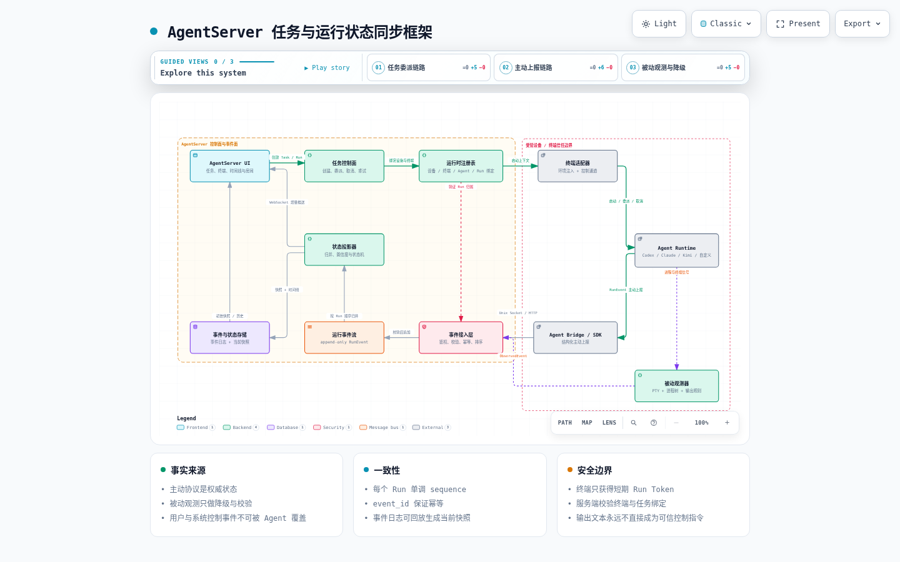

# AgentServer

[](https://github.com/ds199895/AgentServer/actions/workflows/ci.yml)
[](LICENSE)



AgentServer 是一个集中式 FRP 设备管理和 Web SSH 终端。受管设备只需要运行 OpenSSH
Server 和 frpc；设备发现、SSH 探测、登录鉴权、终端、工作区和服务预览统一运行在
AgentServer 所在服务器。

项目也支持本地 PTY，方便单机运行 Codex 或普通 Shell。集中部署时建议通过
`ENABLE_LOCAL_TERMINALS=0` 关闭服务器本地终端。

## 核心功能

- 从 frps Dashboard 自动发现设备，并分别展示 FRP 隧道和 SSH 服务状态。
- 在浏览器中创建多个 SSH/本地终端，支持断线重连、输出回放和 tmux 持久托管。
- 支持递归分屏、独立终端 Tab、预览/固定、跨窗格拖动及布局持久化。
- 提供移动端悬浮辅助键盘；打开时不会唤起手机系统键盘，`Ctrl`、`Alt`、`Shift`
  可锁定并与下一个按键组合。
- 每个终端绑定只读工作区；本地终端访问受限目录，SSH 终端通过 SFTP 访问远端文件。
- 支持文本、图片和 PDF 预览，以及持久化 Artifact 事件和 `read-image` 图片附件。
- 自动识别设备上的 Vite、Next.js、Storybook 等开发服务，并通过 SSH 隧道安全预览。
- 2D 像素游戏风设备房间：终端会话映射为可交互小人，编码 Agent 自动换上品牌服装。
- 提供 Agent 任务、Run、阶段、等待、进度、时间线和父子委派关系的统一状态视图。
- 提供常驻出站的 Runtime Host，每台设备只需安装并配对一个；可从中心页面启动和控制
  Codex app-server Session，无需逐项目配置 Hook，其他 Provider 可扩展 adapter 或保留 Hook fallback。
- 提供 Linux/macOS、Windows 设备安装器，以及 systemd、frpc/frps 和 Nginx 配置示例。
- 通过 GitHub Actions 构建不可变发布制品、原子部署、线上校验和失败回滚。

## 2D 像素房间总览

AgentServer 把所有受管设备渲染成一层像素游戏风格的「设备公寓」：每台设备一间房，
每个终端会话是房间里的一个小人，整层楼的运转状态一眼可见。


- **设备即房间**：地板色带和名牌直接标出 SSH 可用、仅隧道在线、离线三种状态；
  离线房间整体变暗并亮起告警灯。
- **终端即小人**：每个会话一个小人，第一个会话坐在工位前（背面朝向，手在键盘上），
  其余站在地毯上（正面朝向）。当前聚焦的终端脚下有光环，已退出的会话变暗并飘起
  Zzz；点击小人可直接跳转到对应终端。
- **Agent 穿品牌服装**：后端通过终端输出特征加进程树校准，自动识别会话中运行的
  Codex、Claude、Kimi 等编码 Agent，小人会实时换上对应品牌色和像素 Logo 的工服——
  正面胸口和背面衣背都有 Logo，站立和就坐两种朝向都能一眼认出是谁在干活；
  Agent 启动、退出、切换时服装即时更换。
- **工作区跟随**：检测到 Agent 的工作目录与当前工作区不一致时，会弹出确认提示，
  用户确认后自动打开文件树并跳转到 Agent 正在工作的目录。
- **游戏化交互**：支持拖动平移、滚轮缩放，机柜 LED、显示器屏幕、台灯等环境元素
  持续运转，让整层楼是「活的」。

终端页右上角常驻房间缩略图，点击可放大为全屏总览；设备列表页同样内嵌完整世界。

## 架构

[](deploy/agentserver-architecture.html)

点击架构图可打开交互式版本，查看组件来源、关系路径、深浅主题并导出其他格式。

FRP 只负责 TCP 转发。每台设备仍需启用 OpenSSH Server，并将 AgentServer 的 SSH 公钥
加入目标账户的 `authorized_keys`。AgentServer 从 frps Dashboard 同步设备状态，再通过
FRP 暴露的 SSH 端口创建终端、SFTP 工作区和开发服务预览。

生产环境将终端进程与 Web 服务分离：`agentserver-tmux.service` 持有实际 Shell、SSH 和
Codex 进程，`agentserver.service` 负责 API、WebSocket 和前端。部署时只重启 Web 服务，
已有 tmux 终端不会被终止。

## Agent 运行状态（v1）

[](deploy/agent-runtime-framework.html)

当前版本已经具备不可变 Execution Event、Task / Assignment / Run / Agent 投影、字段级证据、
Run 时间线、父子 Run 树、Linux 本地控制通道和浏览器断线重同步。没有主动接入的 Agent
仍可由进程树与 PTY 特征保守识别；无法唯一归属的远端进程会保留为设备级观测，不会猜测
它属于最近使用的终端。

主动上报入口包括 [Reporter CLI](scripts/agentserver_report.py)、HTTP batch API 和
[Device Bridge](scripts/agentserver_bridge.py)，Codex、Claude Code 与 Kimi Code 的原生 Hook 可通过
[Provider Hook](scripts/agentserver_provider_hook.py) 归一化，非交互 JSONL 则由
[Provider Exec](scripts/agentserver_provider_exec.py) 透明转发。Reporter 可上报
`thinking`、`coding`、`tooling`、`testing`、`waiting`、进度、Span、Artifact、完成与失败。
详细运行方式、REST / WebSocket 契约、安全边界、配置和当前限制见
[Agent Runtime v1 文档](docs/agent-runtime-framework.md)。

Reporter 凭据由已登录的管理端按 Run 短期签发，绑定 owner、设备、终端、launch、Agent 与
能力，并由持久 registry 校验失效状态。它不是浏览器 Cookie，也不应写进 `.env`、终端启动
环境、命令历史或仓库。本地控制 socket 和远端 Bridge 的协议只用于公开运行阶段与结果，
不应上报隐藏推理内容。

需要从一个控制面直接管理多台设备上的 Agent 时，可在“安装客户端”页注册设备并生成一次性 enrollment，
再用 [设备一键安装器](scripts/install_agentserver_device.sh) 完成 SSH/FRP、用户 linger 和 Runtime
Host 配对。Host 通过
HTTPS 主动短轮询中心服务，并在设备本地持有 Provider 登录态、工作区和进程；一个 Host 可注册
多个 adapter，当前首个原生实现为 Codex app-server。外部自行启动或尚无主动 adapter 的 Agent 仍走
Hook/JSONL/PTY fallback。每台新设备仍需完成这一次 bootstrap；完成后，受控 Runtime 不需要再为
每个 Provider 或项目单独安装 Hook。

Codex Host 当前只支持 Linux；设备需安装 Python 依赖、已登录的 Codex CLI/Node.js、
`bubblewrap` 并允许非特权 user namespace。安装器会在消费 enrollment token 之前真实运行 sandbox
preflight，并把解析后的绝对路径固化为 service 的 `--bubblewrap-binary`；隔离检查失败时不会配对，
也不会裸跑。bubblewrap 会遮蔽 Host
credential，但不防范 sandbox 外的恶意同 UID 进程；不受信任的本地工作负载应改用独立 UID 或
容器。Host 事件仅在当前 generation 内 at-least-once；新 generation 会把旧 spool 原子移入有界的
durable dead-letter，保留原 envelope/fence 供诊断，而不是清理或静默丢弃。服务端逐事件返回结果：
permanent NACK 转入 Host dead-letter，retryable 或缺失结果继续留在 live spool；配额或 Session 状态
分歧一律失败关闭。只有 enrollment 的同 token 响应恢复窗口固定为 5 分钟；credential rotation 的
持久 `request_id` 可幂等恢复到 replacement 过期或被撤销为止。
具体安装、fencing、配额和 Hook 共存边界见
[多设备 Runtime Host](docs/agent-runtime-framework.md#多设备-runtime-host)。

## 参与贡献

欢迎提交 Issue 和 Pull Request。开始前请阅读 [贡献指南](CONTRIBUTING.md)、
[行为准则](CODE_OF_CONDUCT.md) 和 [安全策略](SECURITY.md)；漏洞请私下报告，不要创建公开
Issue。

## 本地安装与开发

需要：

- Python 3.10+
- Node.js 20.19+；推荐使用与 CI 相同的 Node.js 22
- npm、Git，以及创建虚拟环境所需的 `python3-venv`

```bash
git clone https://github.com/ds199895/AgentServer.git
cd AgentServer
cp .env.example .env
python3 -m venv .venv
./.venv/bin/pip install -r requirements.txt
npm --prefix frontend ci
npm --prefix frontend run build
```

编辑 `.env`，至少设置一个不少于 8 位的管理员密码：

```dotenv
ADMIN_USERNAME=admin
ADMIN_PASSWORD=replace-with-a-long-password
```

然后启动：

```bash
bash scripts/start.sh
```

默认访问地址为 `http://127.0.0.1:18088`。本地数据默认写入 `data/`，不会提交到 Git。

## 生产服务器首次安装

推荐使用 Ubuntu，安装路径为 `/opt/agentserver`，状态目录为 `/var/lib/agentserver`，配置
目录为 `/etc/agentserver`。首次从源码安装会在服务器构建前端，因此服务器还需要
Python 3.10+、`python3-venv`、Git、Node.js 和 npm；安装脚本会自动安装 tmux。

如果 frps 已配置 Dashboard，并且配置文件位于默认的 `/opt/frp/frps.toml`：

```bash
sudo git clone https://github.com/ds199895/AgentServer.git /opt/agentserver
cd /opt/agentserver
sudo bash scripts/configure_server.sh
sudo bash scripts/install_server.sh
```

`configure_server.sh` 会读取 frps Dashboard 账号，生成随机管理员密码和会话密钥。frps
配置在其他位置时，显式传入：

```bash
sudo FRPS_CONFIG=/path/to/frps.toml bash scripts/configure_server.sh
sudo bash scripts/install_server.sh
```

如果不使用自动配置，先运行安装脚本生成模板，填写其中所有 `CHANGE_ME` 后再次运行：

```bash
sudo bash scripts/install_server.sh
sudoedit /etc/agentserver/agentserver.env
sudo bash scripts/install_server.sh
```

自动生成的初始登录信息仅保存在
`/root/agentserver-initial-credentials.txt`，权限为 `0600`。SSH 公钥位于：

```text
/var/lib/agentserver/ssh/id_ed25519.pub
```

将该公钥加入每台设备目标 SSH 用户的 `authorized_keys`，然后检查服务：

```bash
sudo systemctl status agentserver-tmux.service
sudo systemctl status agentserver.service
```

生产服务只监听 `127.0.0.1:18100`，不能直接通过公网 IP 和 18100 端口访问。公网流量应由
Nginx 等反向代理通过 HTTPS 转发。启用 HTTPS 后，还要在
`/etc/agentserver/agentserver.env` 中设置：

```dotenv
COOKIE_SECURE=1
```

修改配置后重启 Web 服务：

```bash
sudo systemctl restart agentserver.service
```

## FRP Token 指引

### Token 是什么、在哪里找

FRP Token 是 frps 与所有 frpc 客户端之间的共享认证密钥，不是 AgentServer 管理员密码，
也不是 SSH 私钥。设备安装器要求输入的值必须与服务器端 frps 使用的值完全一致。

本项目的 [frps.example.toml](frps.example.toml) 默认从以下文件读取 Token：

```text
/etc/frp/token
```

在 frps 服务器上可以这样确认实际路径和值：

```bash
sudo grep -n 'auth.tokenSource' /opt/frp/frps.toml
sudo grep -n 'auth.tokenSource.file.path' /opt/frp/frps.toml
sudo cat /etc/frp/token
```

如果实际 `frps.toml` 不在 `/opt/frp/frps.toml`，请替换为真实路径。如果
`auth.tokenSource.file.path` 指向了其他文件，应读取那个文件；旧配置若直接使用
`auth.token = "..."`，则对应值就是需要输入的 Token。

Token 属于敏感信息，不要写进 Git、截图、聊天记录或命令行参数。查看后只粘贴到安装器的
隐藏输入框，或通过受保护的 Secret/环境变量提供。

### 没有 Token 时快速生成

只在 frps 服务器生成一次 256 位随机 Token，并由所有设备复用：

```bash
sudo install -d -m 0755 /etc/frp
sudo sh -c 'umask 077; openssl rand -hex 32 > /etc/frp/token'
```

确认 `frps.toml` 使用的是这个文件：

```toml
auth.method = "token"
auth.tokenSource.type = "file"
auth.tokenSource.file.path = "/etc/frp/token"
```

保存配置后重启并检查 frps：

```bash
sudo systemctl restart frps
sudo systemctl --no-pager --full status frps
```

如果 `frps.service` 通过非 root 用户运行，应把 Token 文件所有者改为该用户并继续保持
`0600` 权限。生成后用 `sudo cat /etc/frp/token` 查看一次，并将相同值粘贴到各设备安装器
的隐藏输入提示中。不要为每台设备生成不同 Token；重新生成相当于轮换密钥，所有 frpc
客户端都必须同步更新后才能重新连接。

### 什么时候需要输入

- Linux/macOS 全新安装：未设置 `FRP_TOKEN` 时会在终端隐藏提示输入。
- Linux/macOS `--dry-run`：同样需要 Token，以便生成并验证完整配置。
- Linux/macOS 非交互安装：无法显示输入提示，必须通过 `FRP_TOKEN` 环境变量提供。
- Linux/macOS 使用 `--merge-existing`：复用现有 frpc 配置中的 Token，不再提示输入。
- Linux/macOS 重跑相同的受管 AgentServer 配置：校验设备、服务端、端口和 SSH 用户完全一致后，
  复用权限为 `0600` 的现有 Token；参数不一致时不会静默复用。
- 如果确实要在设备侧替换匹配的受管 FRP Token，必须显式使用完整安装器的
  `--rotate-frp-token`（底层脚本为 `--rotate-token`），并同步更新 frps；仅传入新的 token
  文件不会悄悄覆盖现有配置。
- Windows：未传入 `-FrpToken` 时，PowerShell 会通过安全输入框提示输入。

安装器会把 Token 保存到受限文件：

- Linux：`/etc/frp/token`
- macOS：`/usr/local/etc/frp/token`
- Windows：`C:\ProgramData\AgentServer\frp\token`

### 通过管理页面安装设备

登录 AgentServer，打开“安装客户端”，填写：

- 唯一设备 ID；
- 唯一远端端口，范围 `20000-29999`；
- AgentServer 用来 SSH 登录设备的本地用户名。

下载对应安装器后执行。Linux/macOS 示例：

```bash
chmod +x install-frpc-ssh.sh
sudo ./install-frpc-ssh.sh \
  --device-id device-001 \
  --remote-port 20001 \
  --ssh-user your-user
```

运行到 `请输入 FRP token（输入不会显示）` 时，粘贴从 frps 服务器找到的 Token 并回车。

需要同时启用原生 Codex Runtime 的新 Linux 设备，在“安装客户端”页填写上述参数并点击
“注册设备并生成配对凭据”。页面会固定创建 `${DEVICE_ID}.ssh` 代理记录，随后显示只返回一次的
enrollment token 和绑定服务端设备记录的一键命令。目标设备只需安装并登录 Codex CLI/Node.js、安装可用的
`bubblewrap`，不必复制 AgentServer 仓库；以实际工作区用户运行管理页面提供的 bootstrap 命令：

```bash
curl --fail --silent --show-error --proto '=https' --proto-redir '=https' \
  -o install-agentserver-device.sh https://agentserver.example.com/device-bootstrap/install.sh
bash install-agentserver-device.sh \
  --device-id device-001 \
  --base-url https://agentserver.example.com \
  --remote-port 20001 \
  --ssh-user your-user \
  --runtime-user your-user \
  --runtime-bundle-url https://agentserver.example.com
```

Bootstrap 会按当前发布 `BUILD_SHA` 下载不可变 Runtime 制品，先验证压缩包摘要、内部文件清单、
路径和权限，再在 `~/.local/lib/agentserver-runtime/releases/<BUILD_SHA>` 原子落盘；Runtime
Python 虚拟环境按版本复用，credential/state 仍留在 `~/.local/state/agentserver-runtime`。
因此下载目录可以删除，服务不会依赖临时脚本。脚本先以普通用户完成 Python/Codex/Node/bubblewrap
preflight，再仅对 SSH/FRP 和 linger 步骤调用 `sudo`，最后回到该用户安装 Runtime service。
复制的一键命令不包含 enrollment token；以实际工作区普通用户执行后，在隐藏提示中粘贴 FRP token
和页面显示的 enrollment token。自动化可改用权限恰好为 `0600` 的
`--frp-token-file` 与 `--enrollment-token-file`。已有可用隧道时增加 `--runtime-only`。普通重跑
会复用匹配的受管 FRP token 和长期 Runtime credential；只有明确传入 `--reenroll` 才消费新
enrollment token 并替换凭据。已有其他 frpc 时可在完整命令末尾直接增加
`--merge-existing /path/to/frpc.toml`，无需拆成两次安装。

FRP Token 轮换不是普通重跑的一部分：给已有匹配配置传入新的 `--frp-token-file` 或
`FRP_TOKEN` 会失败关闭，避免把设备改成与 frps 不一致的状态。确认 frps 已准备好新 Token 后，
在完整命令中同时增加 `--rotate-frp-token`；轮换过程中配置和 Token 文件仍保持 `0600`。

受管 FRP 的“匹配”是保守判定：配置必须与安装器生成的规范模板完全一致，并通过 owner、权限和
符号链接检查。手工增加字段或注释的配置请使用 `--merge-existing`；普通重跑会失败关闭而不会覆盖。

Windows 请在管理员 PowerShell 中执行：

```powershell
Set-ExecutionPolicy -Scope Process Bypass
.\install-frpc-ssh.ps1 `
  -DeviceId device-001 `
  -RemotePort 20001 `
  -SshUser your-user
```

非交互的 Linux/macOS 自动化应从 Secret 管理器注入环境变量，例如：

```bash
export FRP_TOKEN='value-from-your-secret-store'
sudo env FRP_TOKEN="$FRP_TOKEN" ./install-frpc-ssh.sh \
  --device-id device-001 \
  --remote-port 20001 \
  --ssh-user your-user
unset FRP_TOKEN
```

设备已运行其他 frpc 时，不要启动第二个实例。Linux/macOS 使用：

```bash
sudo ./install-frpc-ssh.sh \
  --device-id device-001 \
  --remote-port 20001 \
  --ssh-user your-user \
  --merge-existing /path/to/frpc.toml
```

安装器会备份并验证原配置、保留现有 Token 和代理、追加 SSH 代理，然后迁移或修复常驻
服务。Windows 安装器目前不自动合并已有 frpc；检测到其他实例时会停止并要求手动处理。

### 手动配置 frpc

先将 frpc 二进制安装为 `/usr/local/bin/frpc`，再将
[frpc.example.toml](frpc.example.toml) 安装为 `/etc/frp/frpc.toml`。把与 frps 相同的
Token 写入 `/etc/frp/token` 并设置权限：

```bash
sudo chmod 0600 /etc/frp/token
```

创建 `/etc/frp/device.env`：

```dotenv
DEVICE_ID=device-001
FRP_SSH_REMOTE_PORT=20001
```

然后安装服务：

```bash
sudo install -m 0644 deploy/frpc.service /etc/systemd/system/frpc.service
sudo systemctl daemon-reload
sudo systemctl enable --now frpc
```

每台设备必须使用不同的 `DEVICE_ID` 和 `FRP_SSH_REMOTE_PORT`。最终代理名称为
`{DEVICE_ID}.ssh`。Linux、macOS 和 Windows 还必须启用 OpenSSH Server。

开发服务预览的泛域名和 Nginx 示例见
[deploy/preview.nginx.example](deploy/preview.nginx.example)。完整环境变量及默认值见
[.env.example](.env.example) 与 [deploy/agentserver.env.example](deploy/agentserver.env.example)。

## 完整验证

先完成“本地安装与开发”中的 Python 和前端依赖安装，然后运行基础测试、布局测试、构建和
静态检查：

```bash
./.venv/bin/python -m unittest \
  tests.test_execution_device_runtime_api \
  tests.test_install_agentserver_runtime -v
./.venv/bin/python -m unittest discover -s tests -v
npm --prefix frontend ci
npm --prefix frontend test
npm --prefix frontend run test:layout
AGENTSERVER_BUILD_SHA="$(git rev-parse HEAD)" npm --prefix frontend run build
npm --prefix e2e ci
./.venv/bin/python -m compileall -q app tests
bash -n scripts/*.sh
git diff --check
```

浏览器契约测试需要 Chromium 和一个隔离的本地服务。以下流程与 CI 的关键环境一致：

```bash
npx --prefix e2e playwright install --with-deps chromium

VERIFY_DATA_DIR="$(mktemp -d)"
ADMIN_PASSWORD=e2e-test-password \
DATA_DIR="$VERIFY_DATA_DIR" \
WEB_DIST=frontend/dist \
AGENTSERVER_BUILD_SHA="$(git rev-parse HEAD)" \
ENABLE_LOCAL_TERMINALS=1 \
TERMINAL_CMD=/bin/sh \
nohup ./.venv/bin/python -m uvicorn app.main:app \
  --host 127.0.0.1 --port 18124 >/tmp/agentserver-e2e.log 2>&1 &
VERIFY_SERVER_PID=$!

cleanup_verify() {
  kill "$VERIFY_SERVER_PID" 2>/dev/null || true
  rm -rf "$VERIFY_DATA_DIR"
}
trap cleanup_verify EXIT

for attempt in $(seq 1 30); do
  if curl -fsS http://127.0.0.1:18124/api/version >/dev/null; then
    break
  fi
  if [ "$attempt" -eq 30 ]; then
    cat /tmp/agentserver-e2e.log
    exit 1
  fi
  sleep 1
done

npm --prefix e2e run contract
cleanup_verify
trap - EXIT
```

GitHub Actions 会对目标为 `main` 的 PR 和 `main` 的 push 执行这些检查。`main` 验证通过后
还会构建不可变 release artifact，部署到 GitHub `production` Environment，并从公网确认
生产版本。

## 构建和部署发布制品

日常部署不要直接复制源码或 `web_dist`。从干净的 Git commit 构建完整制品：

```bash
scripts/build_release.sh
scp dist/agentserver-<sha>.tar.gz* root@server:/tmp/
```

然后在服务器校验并原子切换：

```bash
sudo /opt/agentserver/current/scripts/deploy_release.sh \
  /tmp/agentserver-<sha>.tar.gz
```

部署脚本会安装依赖、切换 `/opt/agentserver/current`、重启 `agentserver.service`、执行版本、
静态资源、登录和终端 API smoke；失败时自动回滚。它不会重启
`agentserver-tmux.service`，因此 Web 服务更新不会终止 tmux 中正在运行的终端。

GitHub 自动部署所需 Environment 配置：

- Variables：`PROD_HOST`、`PROD_SSH_PORT`、`PROD_SSH_USER`、`PROD_BASE_URL`
- Secrets：`PROD_SSH_KEY`、`PROD_KNOWN_HOSTS`

生产部署 key 应在服务器 `authorized_keys` 中绑定
`scripts/github_deploy_receiver.sh` forced command，避免获得交互式 root shell。

真实配置、Token、数据库、日志、PID、SSH 密钥、发布制品和前端依赖均由 `.gitignore`
排除，不应提交到仓库。

## 许可证

AgentServer 采用 [MIT License](LICENSE) 开源。

## 贡献者

项目创建与主要维护者：[@ds199895](https://github.com/ds199895)。感谢每一位提交代码、文档、
测试、问题报告和建议的贡献者；完整名单见 [GitHub Contributors](https://github.com/ds199895/AgentServer/graphs/contributors)。

## 致谢

AgentServer 使用或受到以下开源项目启发，感谢所有维护者和贡献者：

- [frp](https://github.com/fatedier/frp)：设备到服务器的 TCP 穿透与 Dashboard 能力。
- [xterm.js](https://github.com/xtermjs/xterm.js) 和 [tmux](https://github.com/tmux/tmux)：
  浏览器终端渲染与生产终端持久托管。
- [FastAPI](https://github.com/fastapi/fastapi) 和 [React](https://github.com/react/react)：
  后端 API、WebSocket 与前端界面的基础。
- [DeepSeek Harness](https://github.com/deepseek-ai/deepseek-harness)：
  “Everything is a Plugin”的 Provider / Adapter 设计思路。
- [Archify](https://github.com/tt-a1i/archify)：可验证、可交互的项目架构图生成。

其他第三方依赖及其许可证以各项目声明和本仓库锁文件为准。

## Roadmap

### 已完成

- [x] 集中管理 FRP 设备，自动同步在线状态并检测 SSH 可用性。
- [x] 支持多个 SSH/本地终端、断线重连、历史输出回放和 tmux 持久托管。
- [x] 支持递归分屏、独立 Tab、预览/固定、跨窗格拖动和布局恢复。
- [x] 提供移动端悬浮辅助键盘，并适配 `Ctrl`、`Alt`、`Shift` 组合键。
- [x] 提供只读 Local/SFTP 工作区、文件预览、Artifact 事件和 `read-image` 附件。
- [x] 通过 SSH 隧道预览设备开发服务，并自动识别和探活常见 Web 服务。
- [x] 提供 Linux/macOS、Windows 设备安装器和完整 FRP Token 指引。
- [x] 建立不可变制品、GitHub Actions 生产部署、线上校验和失败回滚流程。
- [x] 提供像素风设备房间，并可从场景跳转到终端。
- [x] 识别终端中的 Codex、Claude、Kimi 等编码 Agent（输出特征 + 进程树校准），
  为房间小人换上对应品牌服装（正面与背面均可见），Agent 切换时自动换装。
  远端进程只有在 PID、唯一输出特征或唯一候选能够证明时才绑定终端；歧义结果保持未归属。
- [x] 检测编码 Agent 的工作目录，与当前工作区不一致时提示用户确认后跳转文件树。
- [x] 建立 Task / Assignment / Run / Agent 事件核心，统一 lifecycle、activity、等待、
  进度、完成、失败、证据来源与 freshness。
- [x] 提供 Run 时间线、父子 Run 树、终端精确绑定和 projection 驱动的状态动画。
- [x] 提供 Linux 本地控制 Broker、Reporter CLI/API、离线 spool、短期 Token 轮换和
  带 Lease fence 的命令 ACK journal。
- [x] 接入 Codex、Claude、Kimi Hook/JSONL 原生事件和脱敏夹具，默认丢弃 prompt、命令参数、
  tool output 和 transcript，并保留非交互 Provider 的 stdout 与退出码。
- [x] 提供 CloudEvents、OpenTelemetry、A2A、MCP 的脱敏映射库，并强制显式 key/sink 边界。
- [x] 提供设备级一次性 enrollment、哈希长期凭据、轮换/撤销、常驻 Runtime Host、Codex
  app-server adapter，以及带 generation fence 的多设备 Session/Turn 控制和事件回传。

### TODO

- [ ] 为 Device Runtime Host 增加自动升级、Windows service 安装器，以及 Claude/Kimi 等双向
  Provider adapter；per-Run Bridge 继续使用最小权限短期凭据。
- [ ] 增加经过 tenant ACL、持久 pseudonym key 与背压保护的 OTel/CloudEvents/A2A/MCP exporter。
- [ ] 需要横向扩展时迁移共享 EventStore / live transport；v1 会主动拒绝多个 API worker。
- [ ] 支持自定义房间、工位、角色外观和场景主题。
- [ ] 提供插件式 Agent、Tool 和场景行为 API。
